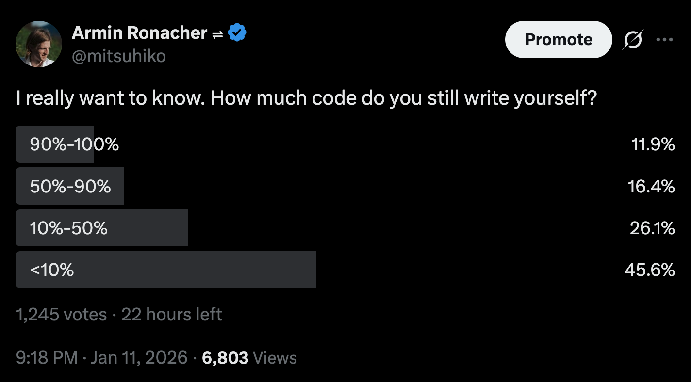
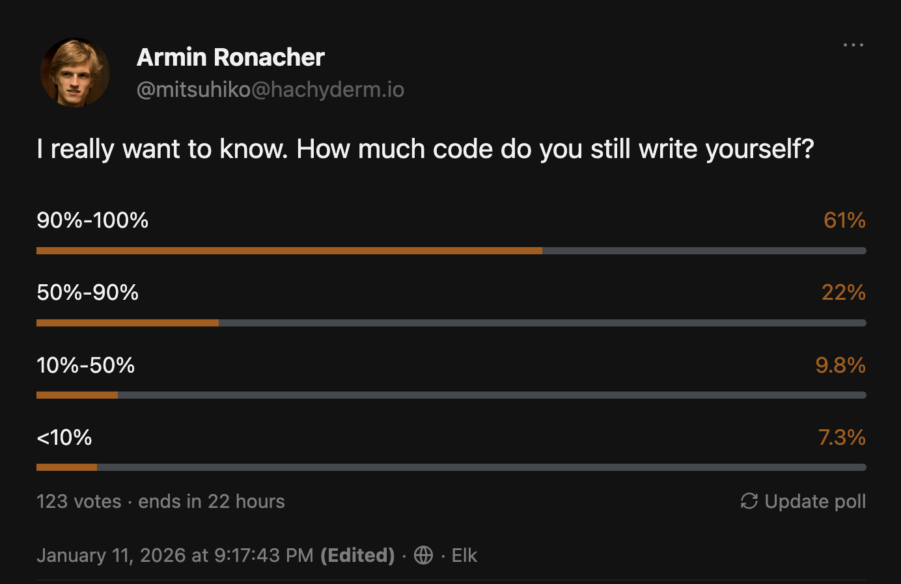
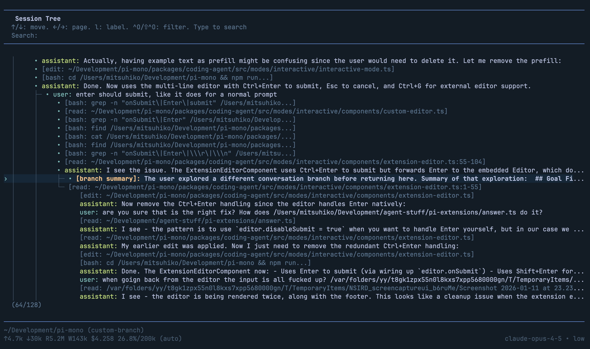
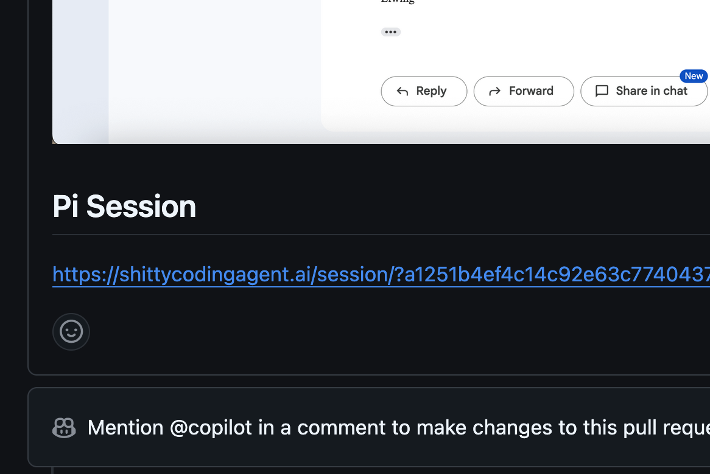
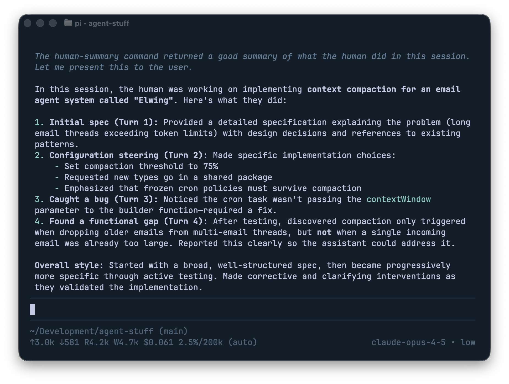

<!-- _class: lead -->

# Me and the Machine

**Armin Ronacher**
@mitsuhiko

---

# February 2023

I wrote a blog post.

---

<!-- _class: quote -->

# "I Think AI Would Kill my Wife"

---

<!-- _class: quote -->

> "Clearly you would not want to just give ChatGPT access to your shell and production services."

— Me, February 2023

---

<!-- _class: quote -->

> "Maybe we should be a bit more careful with what hammers we give that thing."

— Also me, February 2023

---

# April 2025

Claude Code lands.

I give it shell access.

---

# It worked.

---

# What happened?

In 20 years, I've never seen anything like this.

I stopped sleeping. I was completely obsessed.

---

# An Avalanche

I rethought everything — software, economics, who gets to be a programmer, the future of software.

I was hooked.

---

# The Unlock: The Feedback Loop

The agent *does*.

And *validates*.

Rince and repeat.

---

# What Changed For Me Last 9 Months

1. **Models improved**
2. **Harnesses improved**
3. **I learned** — how to work with them

---

<!-- _class: lead -->

# The Future Is Not Evenly Distributed

---

# Same Poll, Different Worlds

<div style="display: flex; gap: 2em; justify-content: center; align-items: center; margin-bottom: 15px">


</div>

**𝕏:** 46% write <10% of their code · **Mastodon:** 61% write 90-100%

Mind the adoption gap. We're living in parallel realities.

---

# Moving Towards Agents

My goal here is to share how coding agents can work.

---

<!-- _class: lead -->

# Agent-First Engineering

---

# Hello Pi


An agent stripped to the core. No bells and whistles.

You need to understand the fundamentals before you add complexity.

---

# Pi

A tiny system prompt and 4 tools:

`read`, `write`, `edit`, `bash`

That's it.

YOLO only. But you and it can extend itself.

---

# Optimizing Context

Tokens are precious.

What goes in, what stays out — this is your job now.

---

# Branch and Rewind

Agent goes astray?  Rewind to earlier.

Pi's `/tree` rewinds with summary.

Use the newfound information to steer.

---



---

# Let the Agent Build Its Own Tooling

Don't prescribe. Ask.

*"What would help you validate this?"*

---

```
# Test jump pad cooldown and cancellation
map assets/maps/fjord_jump.map
god on
frames 5

# Teleport near the jump pad (start is around tile 8,4 = world ~15,7)
teleport 13.0 7.0
frames 5
screenshot debug-temp/jp_01_near_pad.png

# Walk onto the jump pad
input +right
frames 20
input stop
frames 5
screenshot debug-temp/jp_02_on_pad.png

# Walk off during countdown (should cancel jump)
input +left
frames 15
input stop
frames 5
screenshot debug-temp/jp_03_cancelled.png

# Walk back onto pad and let it jump
input +right
frames 15
input stop
# Wait for countdown + jump
frames 80
screenshot debug-temp/jp_04_landed.png

# Now walk off the landing pad (should NOT jump back)
input +right
frames 30
input stop
frames 5
screenshot debug-temp/jp_05_walked_off.png

# Walk back onto landing pad (should now jump back since cooldown cleared)
input +left
frames 15
input stop
# Wait for countdown + jump if it triggers
frames 80
screenshot debug-temp/jp_06_returned.png

quit
```

---

<!-- _class: video-slide -->

<video src="tankdebug.mov" controls style="height: 720px;"></video>

---

# Talk and Refine

Talk to the agent

Go back and forth

Write plan to file

Implement plan

---

<!-- _class: lead -->

# Multiplayer

How do we work as a team with agents?

---

# How We Work

Emphasize human inputs.

Automate validation of outputs.

Agents in the loop.

Automate the guardrails.

---

# Rethinking Pull Requests



Code is 100% AI generated. The human inputs matter.

We share the prompts and how we prompt.

---

# Agent can read the Session



---

# The Simplest Thing

We enforce unique function names (better grep) through linter

We lint away all the things we don't like

Refactorings are cheap now

Share when the agent fails

---

<!-- _class: lead -->

# Software That Builds Itself

---

<!-- _class: video-slide -->

<video src="live-demo-fast.mov" controls style="height: 720px;"></video>

---

# What You Just Saw

The system extended itself.

Not magic. Just tight feedback loops taken to their conclusion.

---

# Where to use this?

Have the agent read through your sessions and analyze itself.

Have the agent do side-quests for better dev tooling.

Talk to the agent to see what it likes.

---

<!-- _class: lead -->

# Full Circle

---

# 2023

> "Be more careful what hammers we give that thing."

---

# 2025

It has sharp hammers.

But the **constraints** make it work.

---

# The Machine Didn't Replace Me

We are the agents.

---

# Questions?

Reach out on X: @mitsuhiko

